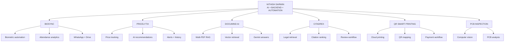

<div align="center">


### `AI/ML ENGINEER` · `JAVA BACKEND DEVELOPER` · `AUTOMATION BUILDER`

<a href="https://linkedin.com/in/nithishsarwin">
  
</a>
<a href="mailto:mnithishsarwin@gmail.com">
  
</a>
<a href="https://github.com/Nithish-code17?tab=repositories">
  
</a>

<br/><br/>


</div>

---

## `01 // SYSTEM IDENTITY`

```yaml
developer:
  name: "M. Nithish Sarwin"
  location: "India"
  role: "AI/ML Student and Software Engineer"
  core_language: "Java"

mission:
  - build reliable backend systems
  - apply AI to practical workflows
  - automate repetitive processes
  - turn ideas into usable products

currently_exploring:
  - Spring Boot and scalable APIs
  - Retrieval-Augmented Generation
  - Intelligent agents
  - Computer vision
  - System design
```

I build software at the intersection of **backend engineering, artificial intelligence, automation, and real-world problem solving**.

My projects are not created only to demonstrate technologies. They are designed around actual problems such as attendance automation, product-price monitoring, document intelligence, legal information retrieval, smart printing, and visual inspection.

---

## `02 // BUILD SIGNAL`

<div align="center">

<table>
<tr>
<td align="center" width="25%">

### BACKEND

Java
Spring Boot
REST APIs
Databases

</td>
<td align="center" width="25%">

### AI / ML

RAG
NLP
Computer Vision
Prediction

</td>
<td align="center" width="25%">

### AUTOMATION

Selenium
Workflow Bots
Scheduled Tasks
Recovery Systems

</td>
<td align="center" width="25%">

### PRODUCT

Problem Analysis
Architecture
Development
Iteration

</td>
</tr>
</table>

</div>

---

## `03 // PROJECT CONSTELLATION`



---

## `04 // SELECTED SYSTEMS`

### `BIOSYNC // Attendance Automation`

> Converts raw biometric attendance into structured reports, notifications, backups, and institution-ready insights.

`Python` `Pandas` `Selenium` `Google Drive API` `Automation`

* Automated biometric data extraction and processing
* Department and student-level attendance summaries
* WhatsApp-ready reporting
* Google Drive synchronization and backup
* Watchdog-based recovery after failures

**Repository:** [BIOSYNC Smart Attendance Platform](https://github.com/Nithish-code17/BIOSYNC-Smart-Attendance-and-Analytical-Platform)

---

### `PRICELYTIX // AI Shopping Intelligence`

> Tracks changing product prices and helps users decide whether to buy now, wait, or continue monitoring.

`Next.js` `TypeScript` `Prisma` `PostgreSQL` `Playwright` `AI`

* Amazon and Flipkart product tracking
* Target-price notifications
* Price-history visualization
* AI shopping assistant
* Authentication and user data isolation
* Scheduled price refresh

**Repository:** [Pricelytix](https://github.com/Nithish-code17/pricelytix)

---

### `DOCUMIND AI // Document Intelligence`

> Lets users upload multiple PDFs and ask grounded natural-language questions over their content.

`Python` `Streamlit` `PyMuPDF` `Sentence Transformers` `Endee` `Gemini`

* Multi-document PDF processing
* Overlapping semantic chunking
* Vector embeddings and retrieval
* Top-context selection
* Gemini-generated grounded answers
* Retrieved-source visibility

**Repository:** [DocuMind AI](https://github.com/Nithish-code17/documind-ai)

---

### `CITADREX // Legal Information Retrieval`

> Experiments with citation-aware ranking and structured retrieval across legal material.

`Python` `NLP` `Information Retrieval` `Data Processing`

* Legal text normalization
* Citation and reference handling
* Candidate generation
* Similarity-based ranking
* Manual review packs
* Human-in-the-loop correction

**Repository:** [CITADREX Legal IR](https://github.com/Nithish-code17/citadrex-legal-ir)

---

## `05 // TECHNOLOGY MATRIX`

<div align="center">

### Core Languages


### Backend and Web


### Data and Storage


### Engineering Tools


<br/>


</div>

---

## `06 // CURRENT OPERATING MODE`

```text
[01] Strengthen Java and Spring Boot
[02] Practice DSA and problem solving
[03] Design scalable backend systems
[04] Build AI-powered applications
[05] Improve testing, security, and deployment
[06] Convert prototypes into production-ready products
```

---

## `07 // ENGINEERING PRINCIPLES`

| Principle                | Meaning                                                    |
| ------------------------ | ---------------------------------------------------------- |
| **Problem first**        | Understand the real need before selecting tools            |
| **Reliability matters**  | Design for failures, retries, validation, and recovery     |
| **Keep it maintainable** | Prefer clear structure over unnecessary complexity         |
| **Use AI with purpose**  | Apply intelligence only where it creates measurable value  |
| **Build end to end**     | Think beyond code: users, data, deployment, and operations |

---

## `08 // GITHUB TELEMETRY`

<div align="center">


<br/>


<br/>


</div>

---

## `09 // OFFLINE PROJECT PIPELINE`

### QR-Based Smart Printing Platform

A QR-driven printing workflow where users can upload documents, configure print options, pay online, and send jobs to a mapped printer.

```text
QR Scan
   ↓
Upload Document
   ↓
Choose Print Settings
   ↓
Complete Payment
   ↓
Queue Print Job
   ↓
Mapped Printer Executes Job
```

---

## `10 // CONNECTION UPLINK`

<div align="center">

### Have an idea involving AI, backend systems, automation, or practical software?

<br/>

<a href="https://linkedin.com/in/nithishsarwin">
  
</a>

<a href="mailto:mnithishsarwin@gmail.com">
  
</a>

<br/><br/>

```text
BUILD STATUS: ACTIVE
LEARNING MODE: CONTINUOUS
NEXT RELEASE: BETTER THAN THE LAST
```

</div>


